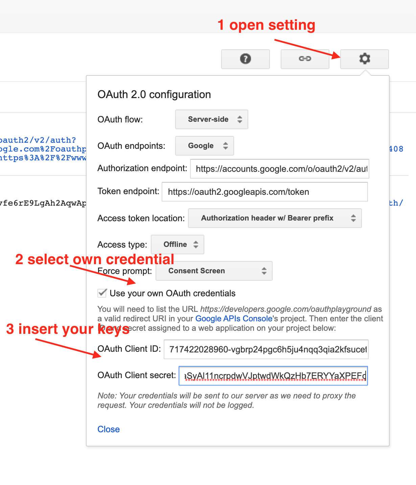

# Setting up Google Oauth 2

Read [https://support.google.com/cloud/answer/6158849?hl=en](https://support.google.com/cloud/answer/6158849?hl=en) in order to create Project and Oauth consent screen.

## test the oauth consent app
open the [https://developers.google.com/oauthplayground/](https://developers.google.com/oauthplayground/) google playground
select a scope, for initial test you can use google Calendar API

    https://www.googleapis.com/auth/calendar

open setting panel and add your keys

click on 'Authorize API' you should see the oauth consent screen.
At the end you can access
- Authorization code
- refresh token
- access token

## Run the example App.

    clone https://github.com/donateoa/oauth2-client.git
    cd oauth2-client
    npm i
    ionic serve

you will find the service at [http://localhost:8100/](http://localhost:8100/home)

## Introduce Oauth2 in your project

### 1. Add the gapi lib in your project.
    
    <!--Add google calendar api-->
    

### 2. Initialize the library with your configuration
create an object like this:

     googleCalendarApiConfig: {
        clientId: 'your-client-id.apps.googleusercontent.com',
        scope: 'https://www.googleapis.com/auth/your-scope',
        apiKey: 'your-api-key',
        discoveryDocs: ['https://www.googleapis.com/discovery/v1/apis/calendar/v3/rest']
    }
replace 
- your-client-id with the clientId from google console
- your-api-key with the api key from google console

### 3. initilize the gapi

    const { clientId, apiKey, scope, discoveryDocs } = googleCalendarApiConfig;
    await gapi.load('client:auth2', async () => {
        this.auth2 = await gapi.client.init({
          apiKey,
          clientId,
          discoveryDocs,
          scope
        });
    });

### 4. handle the authentication state

        // Listen for sign-in state changes.
        gapi.auth2.getAuthInstance().isSignedIn.listen(callbackFunction);
